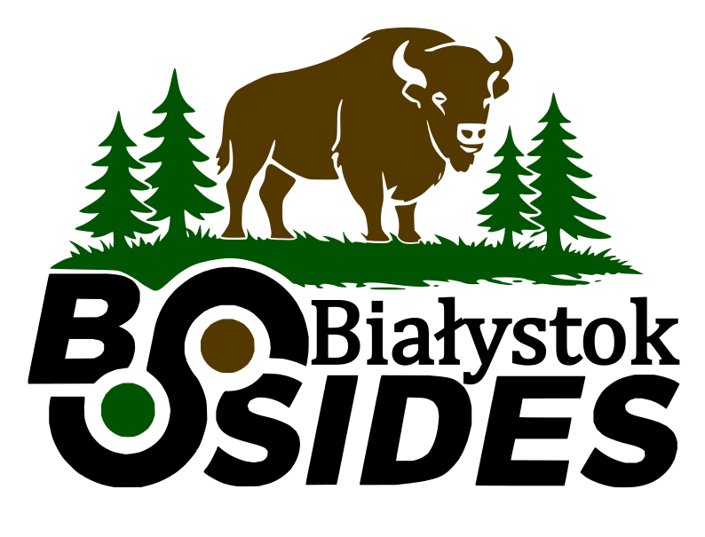

  

  # BSides Białystok

  **A community-run, non-profit information security conference in Białystok, Poland.**

  
  
  

## About

BSides Białystok brings together local and international security professionals for a single-track conference, hands-on training, and a village for hardware and CTF challenges, built entirely by volunteers, for the community.

We're building this the way we build our tools: openly. The conference site and this organisation are developed in the open on GitHub.

## Get involved

- **Attend**: details on tickets and schedule at [bsidesbialystok.pl](https://www.bsidesbialystok.pl/)
- **Sponsor**: sponsorship tiers and application at [/sponsors](https://www.bsidesbialystok.pl/sponsors/)
- **Speak**: see [/speakers](https://www.bsidesbialystok.pl/speakers/) and the schedule page for CFP updates
- **Volunteer / contribute**: this org is open source, issues and pull requests are welcome

All participants (speakers, sponsors, volunteers, and attendees) are expected to follow our [Code of Conduct](https://www.bsidesbialystok.pl/code-of-conduct/).

## Team

- **Dorota Kozłowska**: Founder & Lead Organiser
- **Adrien Lasalle**: Co-Organiser & Badge Creator

## Connect

📍 [Website](https://www.bsidesbialystok.pl/) · 💼 [LinkedIn](https://www.linkedin.com/company/bsidesbialystok/) · ✉️ [contact@bsidesbialystok.pl](mailto:contact@bsidesbialystok.pl)
